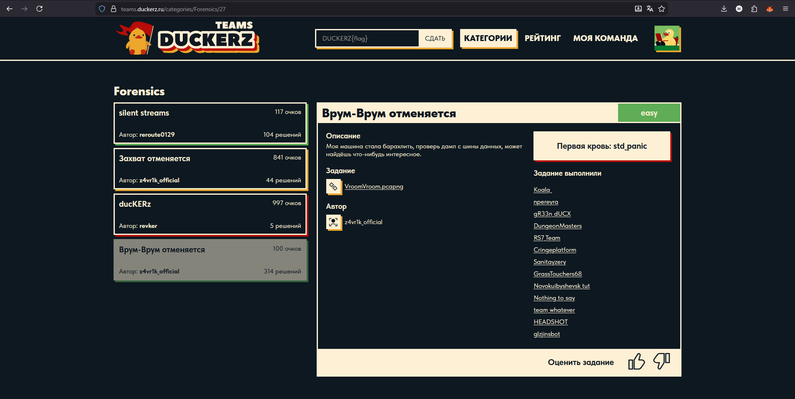
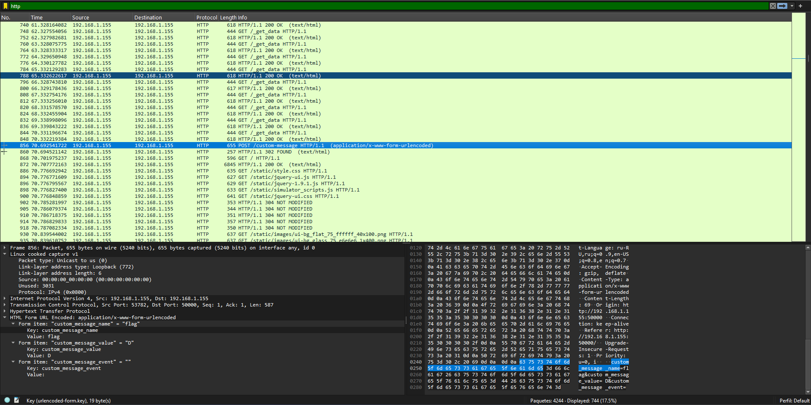
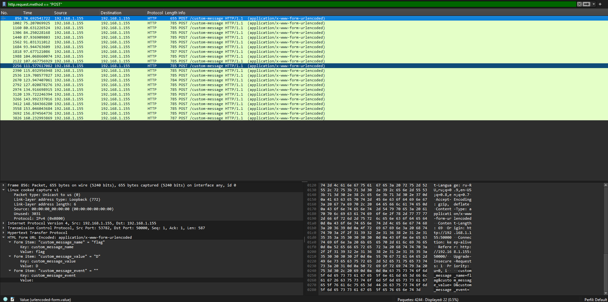

# Writeup: Врум-Врум отменяется  (Duckerz CTF)
*(Vroom-Vroom está cancelado)*

**Categoría:** Forensics  
**URL:** https://teams.duckerz.ru/categories/Forensics/27

---

## 📄 Descripción del desafío

> Моя машина стала барахлить, проверь дамп с шины данных, может найдёшь что-нибудь интересное.  
>  
> *Mi auto empezó a funcionar mal, revisa el volcado del bus de datos, tal vez encuentres algo interesante.*

---

## 📁 Archivos provistos

- `VroomVroom.pcapng` - Captura de tráfico de red

---



## 🔍 Análisis y resolución

### Inspección inicial

Al abrir el archivo de captura en **Wireshark**, se observa una gran cantidad de paquetes correspondientes a distintos protocolos. Para reducir el ruido inicial y enfocarnos en tráfico potencialmente relevante, se decide comenzar filtrando el protocolo **HTTP**, ya que suele contener información legible y es común encontrar datos de interés en este tipo de tráfico.

### Identificación del vector de ataque

Durante el análisis del tráfico HTTP, se detectan múltiples solicitudes realizadas mediante el método **POST** que contienen un campo personalizado denominado `custom-message`. Este campo incluye tres subcampos:

- `custom_message_name`
- `custom_message_value`
- `custom_message_event`



### Filtrado específico

Para aislar estas solicitudes y facilitar el análisis, se aplica el siguiente filtro en Wireshark:
```text
http.request.method == "POST"
```



### Extracción de la flag

Al inspeccionar los valores de los campos en cada paquete POST, se observa un patrón revelador:

- El campo `custom_message_name` contiene consistentemente la palabra **"flag"**
- El campo `custom_message_value` contiene **una única letra** en cada paquete

Analizando la secuencia completa de paquetes y concatenando los valores individuales de `custom_message_value` en orden, se reconstruye el mensaje completo: DUCKERZ{c4n_f0r_DuCk5}

---

## 🚩 Flag
```text
DUCKERZ{c4n_f0r_DuCk5}
```

---

## 💡 Conclusión

Este desafío demuestra la importancia de analizar el tráfico HTTP en capturas de red y prestar atención a campos personalizados que pueden contener información fragmentada. La flag estaba dividida carácter por carácter a través de múltiples solicitudes POST, requiriendo su reconstrucción manual o mediante scripting.