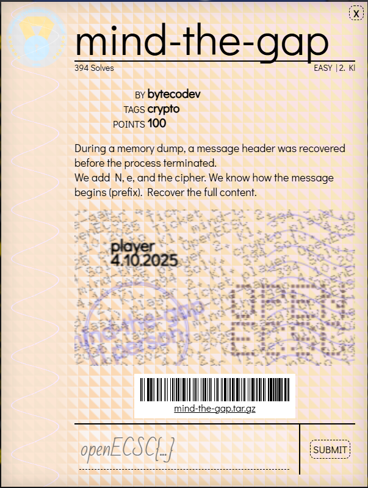

# Challenge: MIND THE GAP

**MIND-THE-GAP**: https://openec.sc/#challenges



## Resumen
Se nos da un RSA público con exponent e = 3, el módulo N y un ciphertext `c`. También conocemos un *prefix* del mensaje: `openECSC{mind_the_gap_`. El objetivo es recuperar el plaintext completo (la flag).

## Datos proporcionados
```json
{
  "N": "14508309593146392036852186367486607754388239123770045829691243154184222998048687640251024592386635569441697046704926723488988355327326504615470145691018948327744499406122769019271226177020244314074490750904060591894303295727249862117568649114289768761885684370964884412426733979181999870253163142239463480329828176240372814784781649967949154525845673601892717561048122900031676770493961212911406501893741411348182441940092726196645991558760193347770520388625214322511344330370596664171127419549482767572865387681019052778209128714326125730339472096608481806721227870805240691046645666979003932603432396724282042435777",
  "e": 3,
  "c": "5046000458278559117779134957838044135098690309585755353058261138276193482137505781482132564608553106896440785493291347385933317040883078691311015088213452902618633863936122902317586074609303885727206126845881797705002735528996492104140693057150294744361533364414645613312759904419925520873230926724120921268840005047605100307811214696752571329125",
  "prefix": "openECSC{mind_the_gap_"
}
```

## Idea principal
RSA cifra como: `c ≡ m^e (mod N)`. Si el mensaje entero `m` cumple `m^e < N` entonces la reducción módulo N no ocurre y `c = m^e` en enteros. Con `e = 3` esto significa que si el mensaje es lo bastante corto, `c` será un cubo perfecto en Z y basta calcular la raíz cúbica entera de `c` para recuperar `m`.

Por eso la estrategia es:
1. Intentar calcular la raíz cúbica entera de `c`.
2. Verificar si es exacta (`root**3 == c`).
3. Convertir `root` a bytes (big-endian) y decodificar en ASCII.
4. Comprobar que el resultado comienza con el prefix conocido y extraer la flag.

## Implementación (Python)
La implementación completa del ataque de exponente bajo RSA se encuentra en el archivo [`script.py`](./script.py).

El script incluye:
- Función `integer_nth_root()` para calcular la raíz cúbica entera de forma robusta
- Valores del challenge extraídos de los datos proporcionados
- Verificación de que la raíz es exacta
- Conversión del resultado a bytes y decodificación ASCII
- Validación del prefijo conocido

Para ejecutar:
```bash
python script.py
```


## Resultado
Al ejecutar el script con los valores del challenge se obtuvo el texto decodificado:

```
openECSC{mind_the_gap_9o8zhlcra7r2snvuktczaw77g}
```

Esa es la flag final.